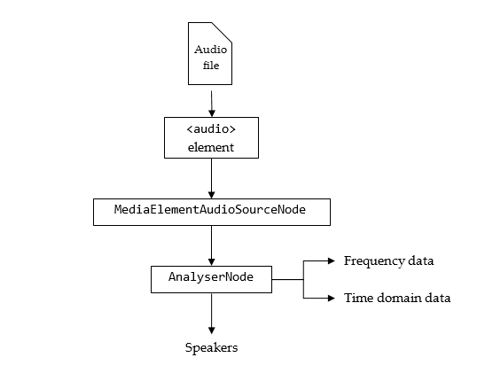

# A technical approach

## Data extraction

Data that will be used for this project is dynamic. As every song changes over time, so will the visualization.
The Web Audio API helps us to extract the characteristics of each song, by creating an array of numbers.

## Building the synthesizer

**Audio nodes** are linked together by their inputs and outputs to form an audio routing graph.
In order to modify the sounds, filter nodes can be attached. The following filters can be used:

- GainNode: makes sound louder or quieter
- BiquadFilterNode: represents different kind of filters (low/high-pass) and tone control devices
- ConvolverNode: creates a reverb effect (echo)
- DelayNode: causes a delay between the arrival of an input data and its propagation to the output
- WaveShaperNode: can be used as a curve to apply waveshaping distortion to the signal. "Adds a warm feeling".

Once the sound has been sufficiently processed for the intended effect, it can be linked to the input of the destination, the **AudioContext.destination**, which send the sound to the speakers or headphones.

## Data visualization

The **AnalyserNode** can be used to collect the characteristics from our audio file and visualize them.
The following properties can be extracted:

- fftSize: determines the frequency domain
- frequencyBinCount: equates to the number of data values you will have to play with for the visualization
- minDecibels: min volume
- maxDecibels: max volume

These methods can be used to store the properties:

- getByteFrequencyData(): copies the current frequency into a Uint8Array
- getByteTimeDomainData(): copies the current waveform, or time-domain, data into a Uint8Array

The option of using a Float32Array is also a possibility. Which array will suit the data better will have to be figured out later in the process.

**window.requestAnimationFrame(callback)**
This methods tells the browser to update the animation onscreen whenever its ready. It will request that the animation function be called before the browser performs the next repaint. This is needed since the visualization will have to update constantly as the data (song) changes over time.

This image shows a summary of the audio route

### _Frequency barchart_

- frameLooper function()
  - window.requestAnimationFrame(frameLooper)
  - getByteFrequencyData() into Uint8Array
  - update barchart with the bar_height determined by the frequency-array

### _Shape visualization_

- frameLooper function()
  - window.requestAnimationFrame(frameLooper)
  - getByteTimeDomainData() into Uint8Array
  - update shape (for example: circle) based on the wavelength-array

### _Synthesizer_

For the visualization of the synthesizer a bootstrap range slider will be used.
Each time the slider handle will be dragged, the current slider value should be updated.

## Linking the visualizations

When a song property is being modified using the synthesizer, the array that is holding it should be updated accordingly.
For example:

- The frequency is increased within the synthesizer by 20%
- Values in the frequency-array should all be multiplied by 1.20
- Frequency barchart should be updated

The same should happen for the wavelength / shape visualization.
